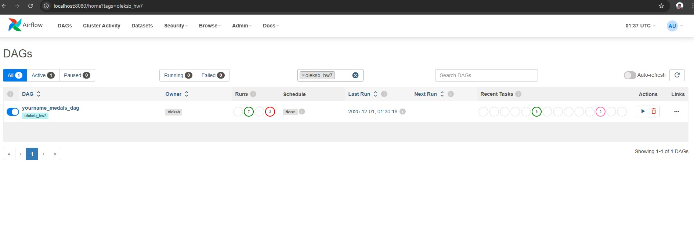
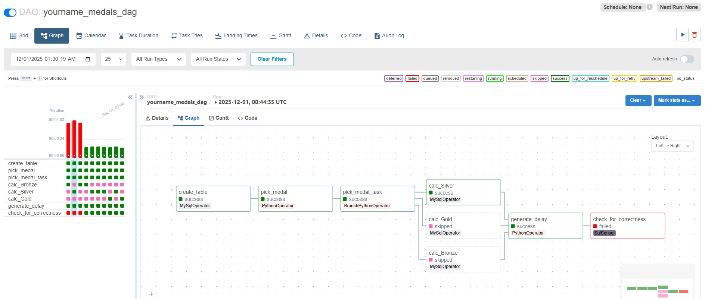

# Apache Airflow

## Опис завдання

Необхідно створити DAG в Apache Airflow, який виконує наступні завдання:

1. Створює таблицю для зберігання результатів обробки
2. Випадково обирає один з трьох типів медалей (Bronze, Silver, Gold)
3. Залежно від обраного значення запускає одне з трьох завдань
4. Кожне завдання рахує кількість записів у таблиці `olympic_dataset.athlete_event_results` з відповідним типом медалі
5. Записує результат у таблицю разом із типом медалі та часом створення
6. Запускає затримку виконання наступного завдання
7. Перевіряє сенсором, чи найновіший запис у таблиці не старший за 30 секунд

## Покрокова інструкція виконання

### 1. Створення таблиці

**Завдання:** `create_table`

Створює таблицю `oleksb.hw_dag_results` з полями:

-   `id` - автоінкремент, головний ключ
-   `medal_type` - тип медалі
-   `count` - кількість записів
-   `created_at` - час створення запису

**Реалізація:** Використано `MySqlOperator` з SQL запитом `CREATE TABLE IF NOT EXISTS`.

### 2. Генерація випадкового значення

**Завдання:** `pick_medal`

Випадково обирає одне з трьох значень: `['Bronze', 'Silver', 'Gold']`.

**Реалізація:** Використано `PythonOperator` з функцією `pick_medal()`, яка використовує `random.choice()`.

### 3. Розгалуження: запуск одного з трьох завдань

**Завдання:** `pick_medal_task`

Залежно від обраного значення запускає одне з трьох завдань:

-   `calc_Bronze` - якщо обрано Bronze
-   `calc_Silver` - якщо обрано Silver
-   `calc_Gold` - якщо обрано Gold

**Реалізація:** Використано `BranchPythonOperator`, який отримує значення з попереднього завдання через XCom та повертає назву наступного завдання.

### 4. Виконання завдань з рахуванням кількості записів

**Завдання:** `calc_Bronze`, `calc_Silver`, `calc_Gold`

**Реалізація:** Використано `MySqlOperator` з SQL запитом `INSERT INTO ... SELECT COUNT(*) ... WHERE medal = '...'`.

**Приклад SQL для Bronze:**

```sql
INSERT INTO oleksb.hw_dag_results (medal_type, count)
SELECT 'Bronze', COUNT(*)
FROM olympic_dataset.athlete_event_results
WHERE medal = 'Bronze';
```

### 5. Реалізація затримки виконання

**Завдання:** `generate_delay`

Запускає затримку виконання наступного завдання, якщо одне з трьох попередніх завдань виконано успішно.

**Реалізація:** Використано `PythonOperator` з функцією `time.sleep(n)` та `TriggerRule.ONE_SUCCESS` для запуску після успішного виконання будь-якого з трьох завдань.

**Примітка:** Для тестування сенсора можна змінити затримку на 35 секунд, щоб перевірити, що сенсор справді "падає", якщо затримка більша за 30 секунд.

### 6. Перевірка найновішого запису

**Завдання:** `check_for_correctness`

Перевіряє за допомогою сенсора, чи найновіший запис у таблиці не старший за 30 секунд (порівнюючи з поточним часом).

**Реалізація:** Використано `SqlSensor` з SQL запитом, який перевіряє різницю між `created_at` найновішого запису та поточним часом.

**SQL запит:**

```sql
SELECT TIMESTAMPDIFF(SECOND,
    (SELECT created_at FROM oleksb.hw_dag_results ORDER BY id DESC LIMIT 1),
    NOW()
) < 30;
```

## Встановлення та налаштування

### Запуск контейнерів

```bash
# Запустіть всі сервіси
docker-compose up -d
```

Ця команда запустить:

-   PostgreSQL (база даних для Airflow метаданих)
-   Redis (брокер для Celery)
-   MySQL (база даних з даними про олімпійські ігри)
-   Airflow Webserver (веб-інтерфейс на порту 8080)
-   Airflow Scheduler (планувальник завдань)
-   Airflow Worker (виконавець завдань)

### Крок 4: Доступ до Airflow UI

Відкрийте браузер та перейдіть за адресою:

```
http://localhost:8080
```

**Облікові дані за замовчуванням:**

-   Username: `airflow`
-   Password: `airflow`

### 4. Налаштування підключення до MySQL

#### Крок 1: Відкрийте Airflow UI

Перейдіть за адресою `http://localhost:8080` та увійдіть в систему.

#### Крок 2: Створіть підключення

1. Перейдіть в меню **Admin** → **Connections**
2. Натисніть кнопку **+** (додати нове підключення)
3. Заповніть форму:
    - **Connection Id:** `goit_mysql_db`
    - **Connection Type:** `MySQL`
    - **Host:** `mysql` (назва сервісу в docker-compose)
    - **Schema:** `olympic_dataset`
    - **Login:** `airflow`
    - **Password:** `airflow`
    - **Port:** `3306`
4. Натисніть **Save**

### 5. Перевірка DAG

1. У Airflow UI перейдіть на вкладку **DAGs**
2. Знайдіть DAG з назвою `yourname_medals_dag`
3. Переконайтеся, що DAG активний (перемикач увімкнено)
4. Перевірте граф завдань



## Тестування сенсора

### Тест 1: Успішне виконання (затримка < 30 секунд)

1. У файлі `dags/oleksb_hw7.py` встановіть затримку на 10 секунд:

    ```python
    def generate_delay():
        print("Sleeping for 10 seconds...")
        time.sleep(10)
    ```

2. Запустіть DAG
3. Сенсор повинен успішно перевірити, що запис не старший за 30 секунд


### Тест 2: Невдале виконання (затримка > 30 секунд)

1. У файлі `dags/oleksb_hw7.py` встановіть затримку на 35 секунд:

    ```python
    def generate_delay():
        print("Sleeping for 35 seconds...")
        time.sleep(35)
    ```

2. Запустіть DAG
3. Сенсор повинен "впасти", оскільки запис буде старший за 30 секунд




## Структура проекту

```
goit-de-hw-07/
├── dags/
│   └── oleksb_hw7.py              # DAG з завданнями обробки медалей
├── screenshots/
│   ├── dags.jpg                    # Скриншот списку DAGs
│   ├── success_dag.jpg              # Скриншот успішного виконання
│   ├── fail_dag.jpg                # Скриншот невдалого виконання (сенсор)
│   └── result_sql_table.jpg        # Скриншот результатів у таблиці
├── athlete_event_results.csv       # CSV файл з даними про олімпійські ігри
├── docker-compose.yaml             # Конфігурація Docker Compose для Airflow
├── import_csv.py                   # Скрипт для імпорту даних в MySQL
└── README.md                       # Документація проекту
```

## Технічні деталі

### Залежності між завданнями

```
create_table
    ↓
pick_medal
    ↓
pick_medal_task (BranchPythonOperator)
    ↓
    ├── calc_Bronze
    ├── calc_Silver
    └── calc_Gold
    ↓
generate_delay (TriggerRule.ONE_SUCCESS)
    ↓
check_for_correctness (SqlSensor)
```
